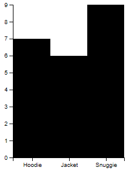
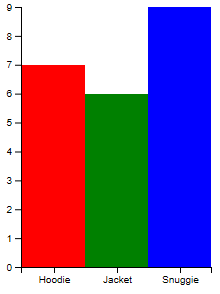
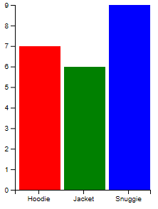
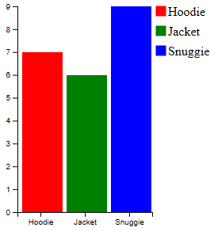

# Advanced Analytics on Big Data
## Module 7: Data Visualization - Mandatory Task
### Ivan Laloux Sbida

---

The aim of this task is to start from a basic, horizontal barchart and convert it into a vertical barchart with the following characteristics:
* Added space between columns
* Customized bar colors
* Legend included

**Baseline**

The following horizontal barchart will be used as the starting point for this exercise:


**Showing vertical bars**

We need to switch X and Y axes by updating all related code:

```javascript
// Mapping canvas width range to show product names on X axis
// (discrete range of values [product names])
function setupXScale() {
  x = d3.scaleBand()
    .rangeRound([0, width])
    .domain(totalSales.map(function(d, i) {
      return d.product;
    }));
}

// Mapping canvas height range to show totalSales values on Y axis
// (linear range of values [0...maxSales])
function setupYScale() {
  var maxSales = d3.max(totalSales, function(d, i) {
    return d.sales;
  });
  y = d3.scaleLinear()
    .range([0, height])
    .domain([maxSales, 0]);
}

function appendXAxis() {
  // Add the X Axis
  svg.append("g")
    .attr("transform",`translate(0, ${height})`)
    .call(d3.axisBottom(x));
}

function appendYAxis() {
  // Add the Y Axis
  svg.append("g")
  .call(d3.axisLeft(y));
}

function appendChartBars()
{
  var rects = svg.selectAll('rect').data(totalSales);
  var newRects = rects.enter();
  newRects.append('rect')
      .attr('y', function(d, i) {
        return y(d.sales);
      })
      .attr('x', function(d, i) {
        return x(d.product);
      })
      .attr('height', function(d, i) {
        return height - y(d.sales);
      })
      .attr('width', x.bandwidth());
}
```

This is the resulting chart:



**Setting custom bar colors**

```javascript
function appendChartBars()
{
  var rects = svg.selectAll('rect').data(totalSales);
  var newRects = rects.enter();
  newRects.append('rect')
      .attr('y', function(d, i) {
        return y(d.sales);
      })
      .attr('x', function(d, i) {
        return x(d.product);
      })
      .attr('height', function(d, i) {
        return height - y(d.sales);
      })
      .attr('width', x.bandwidth())
      .attr('style', function(d, i) {
        return 'fill:' + d.color;
      });
}
```

This is the resulting chart:



**Adding space between columns**

_X position_ (+5) and_ width_ (+5) are adjusted for each rectangle in the barchart in order to leave some empty space between bars:

```javascript
function appendChartBars()
{
  var rects = svg.selectAll('rect').data(totalSales);
  var newRects = rects.enter();
  newRects.append('rect')
      .attr('y', function(d, i) {
        return y(d.sales);
      })
      .attr('x', function(d, i) {
        return x(d.product) + 5;
      })
      .attr('height', function(d, i) {
        return height - y(d.sales);
      })
      .attr('width', x.bandwidth() - 5)
      .attr('style', function(d, i) {
        return 'fill:' + d.color;
      });
}
```

This is the resulting chart:



**Adding a legend**

```javascript
function appendLegend()
{
    var legend = svg.selectAll('.legend')
        .data(totalSales)
        .enter()
        .append('g')
        .attr('class', 'legend')
        .attr('transform', function(d, i) { 
                return "translate(20," + i * 25 + ")"; 
            });
    legend.append('rect')
        .attr('x', width - 15)
        .attr('width', 12)
        .attr('height', 12)
        .style('fill', function(d, i) { return d.color;})
        .style('stroke', function(d, i) { return d.color;});

    legend.append('text')
        .attr('x', width)
        .attr('y', 7)
        .attr("dy", "0.32em")
        .text(function(d) { return d.product; });
}
```

This is the resulting (final) chart:


